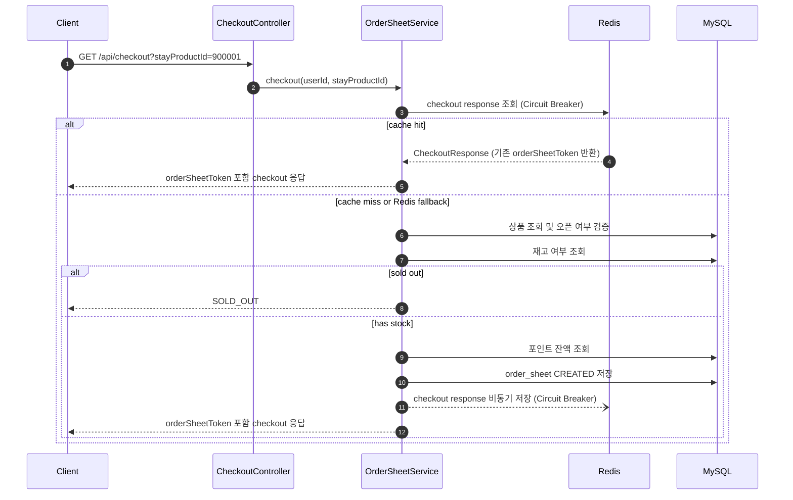
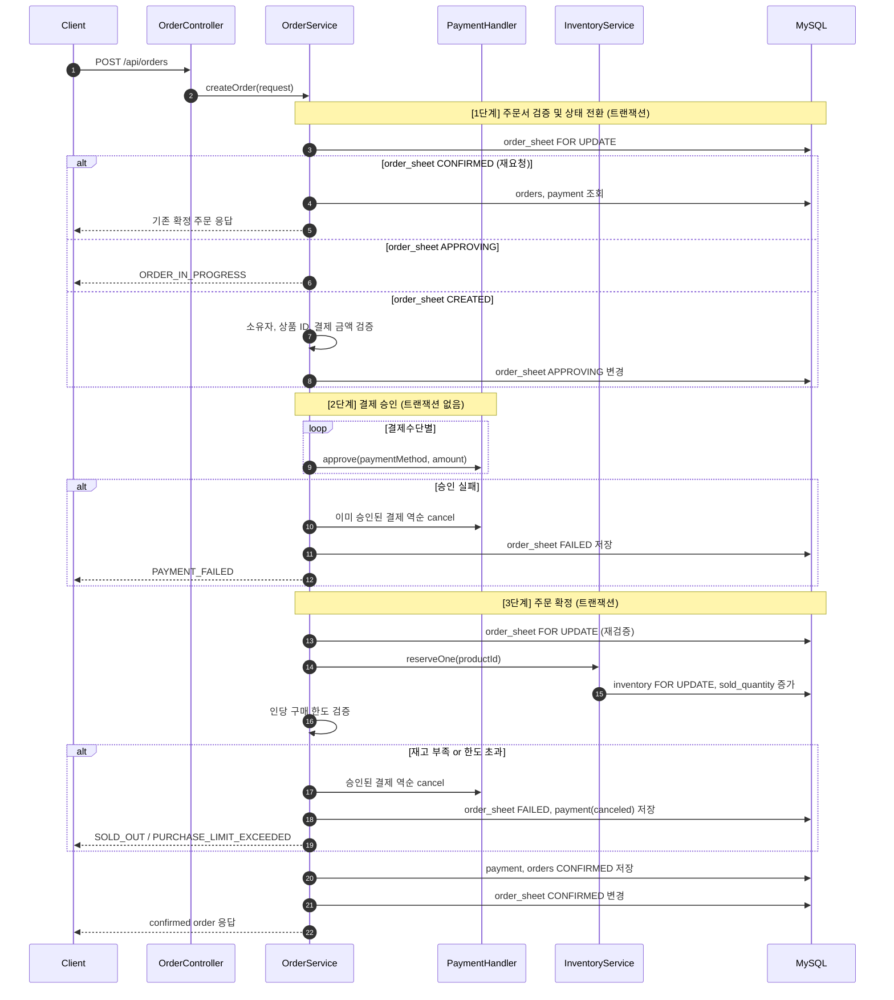
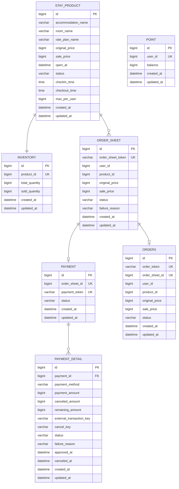

# no-more-oversell

- 제한 수량 숙소 상품의 Checkout, 결제, 주문 확정을 처리하는 Spring Boot 애플리케이션입니다.
- 비관적 락(Pessimistic Lock)과 캐싱을 활용하여 대규모 트래픽 환경에서도 오버셀(Oversell)이 발생하지 않도록 보장합니다.
- Checkout 캐시 웜업으로 서비스 오픈/기동 직후 특정 상품에 몰리는 초기 트래픽의 상품 조회와 품절 판단 비용을 낮춥니다.

## 📌 바로가기

- [기술 스택](#-기술-스택)
- [프로젝트 구조](#-프로젝트-구조)
- [실행 방법](#-실행-방법)
- [로컬 실행](#-로컬-실행)
- [Docker 실행](#-docker-실행)
- [API 명세](#-api-명세)
- [캐시 전략과 웜업](#-캐시-전략과-웜업)
- [예약/결제 흐름](#-예약결제-흐름)
- [ERD](#-erd)
- [테스트 검증](#-테스트-검증)
- [부하 테스트 요약](#-부하-테스트-요약)
- [관련 문서](#-관련-문서)

---

## 🛠 기술 스택

- **Language:** Java 21
- **Framework:** Spring Boot 3.5
- **Data:** Spring Data JPA, QueryDSL, Flyway, MySQL 8.4
- **Cache:** Redis 8.6.3
- **Stability:** Resilience4j Circuit Breaker
- **Test:** Testcontainers, K6

---

## 📂 프로젝트 구조

```text
src/main/java/me/park/nomoreoversell
├── common                 # 공통 예외 응답, WebMvc 설정, Cache Writer
├── config                 # QueryDSL, Cache Executor 설정
├── inventory              # 재고 도메인 (비관적 락 기반 재고 차감)
├── order                  # 주문 생성 API 및 주문 확정 흐름
├── ordersheet             # Checkout API 및 주문서 상태 관리
├── payment                # 결제 Aggregate, 결제수단 Handler, Mock PG Gateway
├── point                  # 포인트 조회, 차감, 복원
└── stayproduct            # 숙소 상품 조회 및 오픈 여부 검증

src/main/resources
├── application.yml        # Datasource, Redis, Flyway, Resilience4j 설정
└── db
    ├── migration          # Flyway DDL Migration 파일
    └── seed               # 로컬 테스트용 Seed Data

load-test                  # K6 부하 테스트 스크립트
http                       # 수동 API 호출 테스트 파일 (.http)
```

---

## ▶️ 실행 방법

목적에 맞게 두 가지 방법 중 하나를 선택하세요.

- **[로컬 실행](#-로컬-실행)** — 인프라(MySQL·Redis)만 Docker로 띄우고, 앱은 Gradle로 직접 실행합니다. 코드 수정·디버깅 등 개발에 권장합니다.
- **[Docker 실행](#-docker-실행)** — 앱까지 모두 컨테이너로 실행합니다. JDK 설치 없이 동작만 확인할 때 권장합니다.

> 💡 어느 방법이든 앱이 기동되면 **Flyway**가 자동으로 DB 마이그레이션(DDL)과 로컬 테스트용 Seed Data를 적재합니다.

#### 📊 Seed Data 주요 정보

| 구분              | 값                                     |
|-----------------|---------------------------------------|
| **예약 가능 상품 ID** | `900001` (판매가: `10,000원` / 재고: `10개`) |
| **품절 상품 ID**    | `900002`                              |
| **테스트 사용자 ID**  | `900001` (보유 포인트: `100,000원`)         |

---

## 🚀 로컬 실행

> 인프라(MySQL·Redis)는 Docker로 띄우고, 애플리케이션은 Gradle로 직접 실행하는 방법입니다.

### 1. 사전 준비

- JDK 21
- Docker / Docker Compose

### 2. 인프라 컨테이너(MySQL·Redis) 실행

```bash
docker compose up -d mysql redis
```

| 서비스   | 주소                |
|-------|-------------------|
| MySQL | `localhost:3306`  |
| Redis | `localhost:6379`  |

### 3. 애플리케이션 실행

```bash
./gradlew bootRun
```

- 기동이 완료되면 `http://localhost:8080` 에서 동작합니다.

### 4. 동작 확인 (선택)

```bash
curl 'http://localhost:8080/api/checkout?stayProductId=900001' -H 'userId: 900001'
```

### 5. 종료

```bash
docker compose down       # 인프라 컨테이너 중지
docker compose down -v    # MySQL 데이터 볼륨까지 삭제
```

---

## 🐳 Docker 실행

> 애플리케이션까지 전부 컨테이너로 실행하는 방법입니다. JDK 설치가 필요 없습니다.

### 1. 사전 준비

- Docker / Docker Compose

### 2. 앱과 인프라 실행

```bash
./scripts/run-app.sh
```

이 스크립트는 `docker-compose.yml`의 MySQL·Redis와 `docker-compose.app.yml`의 앱 컨테이너를 함께 실행합니다.
이미지는 로컬에서 자동으로 빌드됩니다.

### 3. 동작 확인 (선택)

```bash
curl 'http://localhost:8080/api/checkout?stayProductId=900001' -H 'userId: 900001'
```

### 4. 종료

```bash
# 앱 로그 화면은 Ctrl+C로 종료합니다.
docker compose -f docker-compose.yml -f docker-compose.app.yml down
docker compose -f docker-compose.yml -f docker-compose.app.yml down -v  # MySQL 데이터 볼륨까지 삭제
```

---

## 🔌 API 명세

> ⚠️ 인증/로그인 처리는 범위에서 제외하였으며, 사용자 식별은 HTTP Header의 `userId` 값으로 대신합니다.

### 1. Checkout (주문서 발행)

상품 정보와 실시간 재고를 확인하고, 재고가 있으면 유저 가용 포인트를 조회한 뒤 주문을 위한 토큰을 발급합니다.
재고가 없으면 주문서 토큰을 발급하지 않고 `SOLD_OUT`으로 응답합니다.

- **HTTP Method & URL:** `GET /api/checkout`
- **Request Example:**

```bash
curl -X GET 'http://localhost:8080/api/checkout?stayProductId=900001' \
  -H 'userId: 900001'
```

- **Response Example (200 OK):**

```json
{
  "orderSheetToken": "4f8a7c7a-0c50-4b6b-b0a9-4c91b9d98b6a",
  "stayProduct": {
    "id": 900001,
    "accommodationName": "로컬 테스트 호텔",
    "roomName": "디럭스 더블",
    "ratePlanName": "선착순 특가",
    "originalPrice": 20000,
    "salePrice": 10000,
    "openAt": "2026-01-01T00:00:00",
    "checkinTime": "15:00:00",
    "checkoutTime": "11:00:00",
    "maxPerUser": 1,
    "hasStock": true
  },
  "user": {
    "availablePoint": 100000
  }
}
```

### 2. Orders (결제 승인 및 주문 확정)

발급받은 주문서 토큰과 복합 결제수단 정보를 검증하여 최종 결제를 완료하고 주문을 생성합니다.

- **HTTP Method & URL:** `POST /api/orders`
- **Request Example:**

```bash
curl -X POST 'http://localhost:8080/api/orders' \
  -H 'Content-Type: application/json' \
  -H 'userId: 900001' \
  -d '{
    "orderSheetToken": "4f8a7c7a-0c50-4b6b-b0a9-4c91b9d98b6a",
    "stayProductId": 900001,
    "paymentDetails": [
      {"paymentMethod": "CARD", "amount": 9000},
      {"paymentMethod": "POINT", "amount": 1000}
    ]
  }'
```

- **Response Example (200 OK):**

```json
{
  "order": {
    "id": 1,
    "orderToken": "129b9e91-ec57-4374-8c08-00f40df452c5",
    "orderSheetToken": "4f8a7c7a-0c50-4b6b-b0a9-4c91b9d98b6a",
    "status": "CONFIRMED"
  },
  "stayProduct": {
    "id": 900001,
    "accommodationName": "로컬 테스트 호텔",
    "roomName": "디럭스 더블",
    "ratePlanName": "선착순 특가"
  },
  "payment": {
    "status": "APPROVED",
    "totalPaymentAmount": 10000,
    "details": [
      {
        "paymentMethod": "CARD",
        "paymentAmount": 9000,
        "status": "APPROVED"
      },
      {
        "paymentMethod": "POINT",
        "paymentAmount": 1000,
        "status": "APPROVED"
      }
    ]
  }
}
```

#### 🚨 주요 비즈니스 에러 코드 (Error Code)

- `SOLD_OUT`: 상품 품절
- `ORDER_IN_PROGRESS`: 현재 주문 처리 중
- `PAYMENT_FAILED`: PG사 결제 승인 실패 또는 포인트 잔액 부족
- `INVALID_PAYMENT_COMBINATION`: 결제 금액 불일치 혹은 잘못된 조합
- `PURCHASE_LIMIT_EXCEEDED`: 유저당 최대 구매 수량 초과
- `INVALID_ORDER_SHEET_STATE`: 유효하지 않은 주문서 상태
- `ORDER_SHEET_OWNER_MISMATCH`: 주문서 생성자와 요청자 불일치
- `PRODUCT_NOT_OPEN`: 상품 판매 기간이 아님

---

## ⚡ 캐시 전략과 웜업

Redis는 재고 정합성의 원천이 아니라 Checkout 응답 속도를 높이는 보조 계층으로 사용합니다.
Redis 조회가 실패하거나 Circuit Breaker가 열리면 DB 조회로 fallback하여 캐시 장애가 예약 흐름 전체 장애로 번지지 않게 했습니다.

- **Checkout 응답 캐시:** 같은 사용자가 같은 상품 Checkout에 재진입하면 기존 `orderSheetToken` 포함 응답을 재사용합니다.
- **상품 조회 캐시:** 반복 조회되는 숙소 상품 정보를 Redis에 저장해 Checkout 단계의 DB 조회 비용을 줄입니다.
- **품절 힌트 캐시:** 이미 품절된 상품은 재고 DB 조회 전에 빠르게 `SOLD_OUT`으로 판단합니다.
- **비동기 캐시 쓰기:** 캐시 저장 실패나 executor 포화가 요청 처리 흐름으로 전파되지 않도록 분리했습니다.
- **캐시 웜업:** 애플리케이션 기동 시 지정 상품의 상품 정보와 품절 힌트를 미리 적재해 서비스 오픈/기동 직후 특정 상품에 몰리는 초기 트래픽을 감당하기 쉽게 합니다.

기본 설정에서는 로컬 Seed Data의 예약 가능 상품과 품절 상품을 웜업 대상으로 사용합니다.

```yaml
checkout:
  cache:
    warm-up:
      enabled: true
      product-ids:
        - 900001
        - 900002
```

웜업 중 특정 상품 적재에 실패해도 애플리케이션 기동은 중단하지 않고 로그를 남긴 뒤 다음 상품 처리를 계속합니다.

---

## 🔄 예약/결제 흐름

### 1. GET /api/checkout



### 2. POST /api/orders



---

## 📊 ERD



---

## 🧪 테스트 검증

통합 테스트는 **Testcontainers**로 MySQL 컨테이너를 띄워 실행합니다.
H2 같은 대체 DB가 아니라 실제 운영과 동일한 MySQL 계열 데이터베이스 엔진에서 JPA 매핑, Flyway DDL, unique/check 제약, 비관적 락 동작을 함께 검증합니다.

- **단위 테스트 수행:**
  ```bash
  ./gradlew test
  ```
- **통합 테스트 수행:**
  ```bash
  ./gradlew integrationTest
  ```
- **전체 코드 검증 및 빌드:**
  ```bash
  ./gradlew check
  ```

---

## 📈 부하 테스트 요약

**K6** 기반 부하 테스트를 통해 대규모 주문 트래픽 상황에서의 동시성 제어 유효성을 검증했습니다.

- **실행 방법:** `./load-test/run.sh`
- **테스트 시나리오:** Checkout API 및 Order API 각각 `1,000 TPS × 60초` 발생

### 📊 성능 지표 요약

- **Checkout 단계:** Redis 캐싱을 기반으로 모든 인프라 환경에서 목표치 **`1,000 TPS` 안정적 유지**
- **Order 단계:** 락 경합(Lock Contention) 제어로 인해 컨테이너 할당 CPU 개수에 따라 처리 속도 차이 발생
    - **6 CPU:** `682.8/s` 처리, p95 `9.80초`
    - **8 CPU:** `820.3/s` 처리, p95 `7.43초`
    - **10 CPU:** `906.4/s` 처리, p95 `5.13초`
- **Order 한계:** 10 CPU에서도 `dropped_iterations`가 남아 목표 `1,000 TPS`를 완전히 유지하지는 못함

> 💡 **주요 결론:** 모든 부하 환경에서 5xx 서버 에러가 0건이었으며, 고부하 경합 상태에서도 최종 확정 주문 수와 재고 차감 개수가 실제 제한 재고 수량을 초과하지 않아 오버셀 제로(0)를 검증했습니다.

---

## 📄 관련 문서

- [DECISIONS.md](DECISIONS.md) - 주요 설계 결정 및 트레이드 오프(Trade-off) 기록
- [AI_USAGE.md](AI_USAGE.md) - 개발 생산성 향상을 위한 AI 활용 기록
- [load-test/README.md](load-test/README.md) - 부하 테스트 환경 구성 및 결과 리포트
